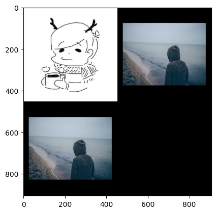
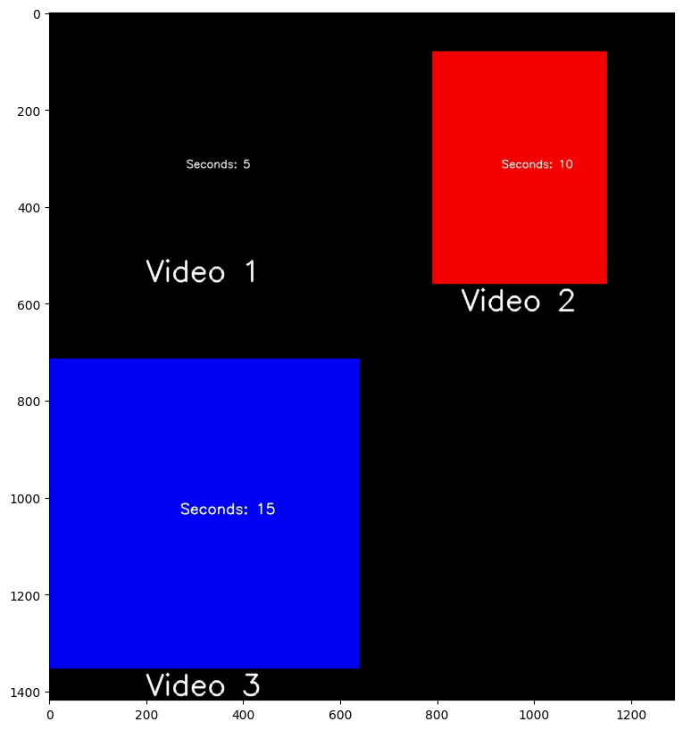

# Common Utilities

When working on computer vision tasks, developers often find themselves spending a considerable amount of time writing code for debugging or comparisons. Tasks such as displaying an image, downloading an image with a specific size, combining images or videos, extracting frames from videos, or displaying a folder tree of working directories can be time-consuming.

**Kano** is a utilities library designed to simplify these tasks with just a few lines of code. It offers functions to handle common tasks, which can be categorized into [**image tasks**](image_utils.md), [**video tasks**](video_utils.md), and [**file tasks**](file_utils.md). Here are some examples:

**Test demo with Google Colab here:**  [](https://colab.research.google.com/drive/181jZX3PNylk0Ry133e9ZH5k2vlPV9zxW?usp=sharing)

## Image tasks

### Download images from urls and show


The `show_image` code is compatible when running with both .py and .ipynb files.

```py
from kano.image_utils import download_image, show_image


image = download_image("https://avatars.githubusercontent.com/u/77763935?v=4", "image.jpg")

# using numpy array
show_image(image)

# using file path
show_image("image.jpg")
```

Result:


### Download image with desired size

``` py
from kano.image_utils import get_random_image


desired_image = get_random_image(width=400, height=300, save_path="random_image.jpg")

# using numpy array
show_image(desired_image)

# using file path
show_image("random_image.jpg")
```

Result:


### Combine images

The input images must be numpy arrays.

``` py
from kano.image_utils import concatenate_images


image_list = [
    [image, desired_image],
    [desired_image]
]

concatenated_image = concatenate_images(image_list)
show_image(concatenated_image)
```

Result:



## Video tasks

### Download youtube videos from urls

This function used [pytube](https://github.com/pytube/pytube) library to download youtube video.

``` py
from kano.video_utils import download_youtube_video


download_youtube_video("https://youtu.be/wc-wPvawmj8", "video_1.mp4")
download_youtube_video("https://youtube.com/shorts/TJVXPkvSPck", "video_2.mp4")
download_youtube_video("https://youtube.com/shorts/-QCs2GSLLUM", "video_3.mp4")
```

### Extract frames from a video

Extract frames with a `seconds_interval` between each pair of consecutive frames, placed one after the other

``` py
from kano.video_utils import extract_frames


extract_frames("video_1.mp4", "target_folder", seconds_interval=1)
```

### Combine videos

``` py
from kano.video_utils import concatenate_videos

video_paths = [
    ["video_1.mp4", "video_2.mp4"],
    ["video_3.mp4"]
]

titles = [
    ["Video 1", "Video 2"],
    ["Video 3"],
]

output_video_path = "output_video.mp4"

concatenate_videos(video_paths, titles, output_video_path)
```

A frame of concatenated video:



## File tasks

### List files, folders from a path

``` py
from kano.file_utils import list_files, list_folders


print("List files paths :", list_files("target_folder"))
print("List folders paths: ", list_folders("/content"))
```

Result:

``` bash
List files paths : ['/content/target_folder/frame_000.jpg', '/content/target_folder/frame_030.jpg', '/content/target_folder/frame_060.jpg', '/content/target_folder/frame_090.jpg', '/content/target_folder/frame_120.jpg']
List folders paths:  ['/content/.config', '/content/output_video_frames', '/content/sample_data', '/content/target_folder']
```

### Print the folder tree

```py
from kano.file_utils import print_foldertree


print_foldertree("/content", max_level=1, verbose=True)
```

Result:

```
/content (6 files + 4 folders)
|
|-- image.jpg (32.70 KB)
|-- output_video.mp4 (32.41 KB)
|-- random_image.jpg (19.67 KB)
|-- video_1.mp4 (67.22 KB)
|-- video_2.mp4 (261.71 KB)
|-- video_3.mp4 (265.52 KB)
|
|-- .config (7 files + 2 folders)
|
|-- output_video_frames (5 files + 0 folders)
|
|-- sample_data (6 files + 0 folders)
|
|-- target_folder (5 files + 0 folders)
```

### Create, remove a folder

Create a folder with its parent folders and remove a folder with its children items

```py
from kano.file_utils import create_folder, remove_folder


create_folder("new_folder")
print_foldertree("/content")

print("\n")

remove_folder("new_folder")
print_foldertree("/content")
```

Result:

```
/content (6 files + 5 folders)
|
|-- image.jpg (32.70 KB)
|-- output_video.mp4 (32.41 KB)
|-- random_image.jpg (19.67 KB)
|-- video_1.mp4 (67.22 KB)
|-- video_2.mp4 (261.71 KB)
|-- video_3.mp4 (265.52 KB)
|
|-- .config (7 files + 2 folders)
|
|-- new_folder (0 files + 0 folders)
|
|-- output_video_frames (5 files + 0 folders)
|
|-- sample_data (6 files + 0 folders)
|
|-- target_folder (5 files + 0 folders)


Folder 'new_folder' and its contents removed successfully.
/content (6 files + 4 folders)
|
|-- image.jpg (32.70 KB)
|-- output_video.mp4 (32.41 KB)
|-- random_image.jpg (19.67 KB)
|-- video_1.mp4 (67.22 KB)
|-- video_2.mp4 (261.71 KB)
|-- video_3.mp4 (265.52 KB)
|
|-- .config (7 files + 2 folders)
|
|-- output_video_frames (5 files + 0 folders)
|
|-- sample_data (6 files + 0 folders)
|
|-- target_folder (5 files + 0 folders)
```
