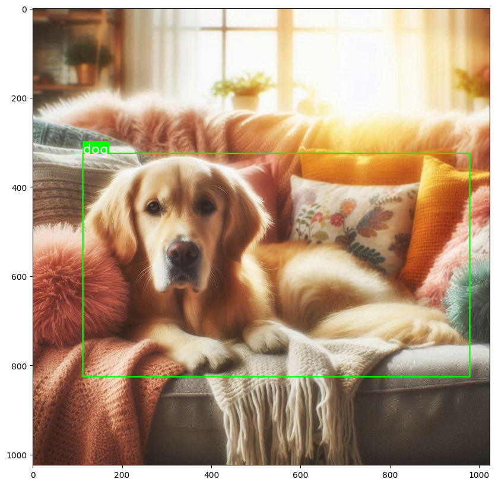
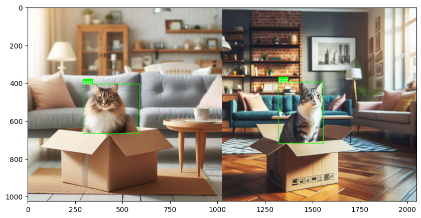
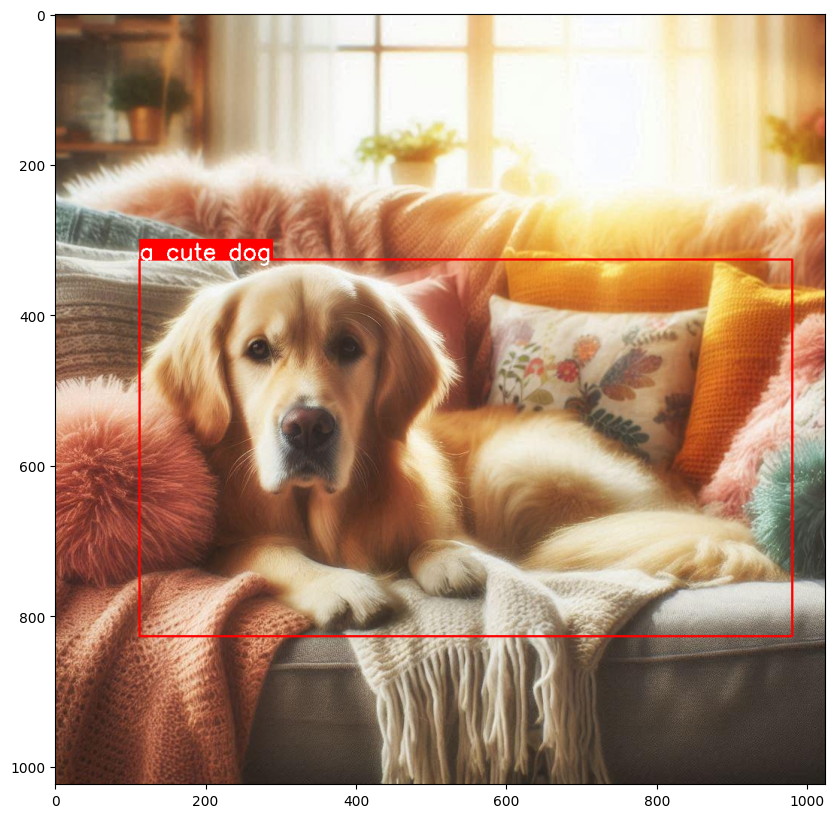

# Computer Vision Utilities

**Kano** currently offers classes for handling YOLO-formatted datasets, one of the most commonly used formats in Object Detection tasks. With the `YoloImage` and `YoloDataset` classes, developers can load, explore, merge, split, and rename their datasets. Here are some examples:

**Test demo with Google Colab here:**  [](https://colab.research.google.com/drive/1f8H-QzypOlpzA6sUR0WF3IGxtY6xmF1U?usp=sharing)

## YOLO-formatted dataset tasks

!!! Note
    A valid YOLO-formatted dataset will have a folder tree like this
    ```
        dataset_name:
        ├─ train
        |  ├─ images
        |  |  ├─ image1.jpg
        |  |  └─ ...
        |  └─ labels
        |     ├─ image1.txt
        |     └─ ...
        ├─ valid (optional)
        ├─ test (optional)
        └─ data.yaml (must include a list of classes names inside "names" field)
    ```

### Load and show a YOLO image

```py
from kano.dataset_utils import YoloImage


label_dict = {0: "dog"}
image_path = "/content/dog_detection/train/images/dog_1_jpg.rf.dc6fff7fee9b6fb637b890b8387c6ce0.jpg"
image = YoloImage(image_path, label_dict)
image.show_image()
image.show_annotated_image()

# or you can get the annotated image and show with image_utils
from kano.image_utils import show_image


annotated_image = image.get_annotated_image()
show_image(annotated_image)
```

Result:

Original image: 

Annotated image: 

### Load and show summary of a YOLO dataset

``` py
from kano.dataset_utils import YoloDataset


dataset_path = "/content/cat_detection"
dataset = YoloDataset(dataset_path)

# print summary information
dataset.summary()

# plot sample images
dataset.show_sample()
```

Result:

```
Summary dataset cat_detection:
- Classes:  ['cat']
- Subsets:
  + train: 1 images
  + test: 1 images
- Total images: 2
```


### Merge datasets

When merging datasets, the names are also merged and reindexed alphabetically. The training images will be saved in the train folder, and similarly for the validation and test folders.

``` py
from kano.dataset_utils import YoloDataset


datasets_paths = ["cat_detection", "dog_detection"]
merged_dataset_path = "animals_detection"

YoloDataset.merge_datasets(datasets_paths, merged_dataset_path)

YoloDataset(merged_dataset_path).show_sample()
```

Result:

```
Input datasets:
Summary dataset cat_detection:
- Classes:  ['cat']
- Subsets:
  + train: 1 images
  + test: 1 images
- Total images: 2
Summary dataset dog_detection:
- Classes:  ['dog']
- Subsets:
  + train: 1 images
  + valid: 1 images
- Total images: 2
Merged dataset:
Summary dataset animals_detection:
- Classes:  ['cat', 'dog']
- Subsets:
  + train: 2 images
  + valid: 1 images
  + test: 1 images
- Total images: 4
```


### Split train, validation, test datasets

``` py
from kano.dataset_utils import YoloDataset


dataset = YoloDataset("animals_detection")
dataset.split("splitted_dataset", ratios=[0.4, 0.3])
```

Result:

```
Summary dataset animals_detection:
- Classes:  ['cat', 'dog']
- Subsets:
  + train: 2 images
  + valid: 1 images
  + test: 1 images
- Total images: 4
Summary dataset splitted_dataset:
- Classes:  ['cat', 'dog']
- Subsets:
  + train: 1 images
  + valid: 1 images
  + test: 2 images
- Total images: 4
```

### Rename classes

Classes can be removed by renaming to `None`.

``` py
from kano.dataset_utils import YoloDataset


renamed_dataset_path = "renamed_dataset"
renaming_dict = {"cat": "animal", "dog": None}

dataset = YoloDataset("animals_detection")
dataset.rename_classes(renamed_dataset_path, renaming_dict)

renamed_dataset = YoloDataset(renamed_dataset_path)
renamed_dataset.show_sample()
```

Result

```
Summary dataset animals_detection:
- Classes:  ['cat', 'dog']
- Subsets:
  + train: 2 images
  + valid: 1 images
  + test: 1 images
- Total images: 4
Classes after renaming: ['animal']
Summary dataset renamed_dataset:
- Classes:  ['animal']
- Subsets:
  + train: 2 images
  + valid: 1 images
  + test: 1 images
- Total images: 4
```


## Object Detection tasks

### Draw bounding box

You can add label for the bounding box. Current supported types of box are `xyxy`, `xywh`, `s_xywh` (scaled `xywh`).

``` py
import cv2
from kano.image_utils import show_image
from kano.detect_utils import draw_bbox


image_path = "/content/dog_detection/train/images/dog_1_jpg.rf.dc6fff7fee9b6fb637b890b8387c6ce0.jpg"
image = cv2.imread(image_path)

label = "a cute dog"
bbox = [112, 326, 980, 827]

annotated_image = draw_bbox(image, bbox, bbox_type="xyxy", label=label, bbox_color=(0, 0, 255))
show_image(annotated_image)
```

Result:




## Track FPS of your pipeline with FPSCounter Class

The `FPSCounter` class tracks the number of frames processed over time and computes the FPS. It also provides an option to print FPS at specified intervals and ensure that the FPS does not exceed a target value.

```python
import time

from kano.profiler import FPSCounter

# Initialize FPSCounter with a 1-second print cycle
fps_counter = FPSCounter(fps_print_cycle=1, prefix_fps_print="App")

# Simulate frame processing
for i in range(100):
    fps_counter.update()
    time.sleep(0.01)  # Simulating 100 frames per second (10ms per frame)
```

Result:

```
App FPS: 100
App FPS: 100
App FPS: 100
...
```

---

## Get CPU percent and RAM usage of your python process

The `ResourceProfiler` class monitors the system's CPU and RAM usage for a given process (default is the current process) and logs the data to a CSV file. You can also print the resource usage at specified intervals.

```python
import time

from kano.profiler import ResourceProfiler

# Initialize ResourceProfiler to monitor CPU and RAM usage every 2 seconds
profiler = ResourceProfiler(interval_seconds=2, csv_path="resource_usage.csv")

# Start monitoring and printing data every 2 seconds
while True:
    profiler.update()
    time.sleep(1)
```

Result:

```
PID: 12345 - CPU Usage: 12.3% - total RAM: 200.15 MiB
PID: 12345 - CPU Usage: 14.1% - total RAM: 202.35 MiB
...
```


## Get real-time frame with `VideoStreamer`

The `VideoStreamer` class streams video from a source (file or camera) and retrieves frames in real-time, ensuring that the current frame is always processed without delay. Unlike `cv2.VideoCapture`, which might introduce a delay while waiting for the next frame in the stream, `VideoStreamer` fetches the frame at the current time, making it ideal for real-time processing.


```python
from kano.source_reader import VideoStreamer


video_streamer = VideoStreamer("video.mp4")
while True:
    frame = video_streamer.get_latest_frame()
    print(frame.shape)  # Process the frame
```
