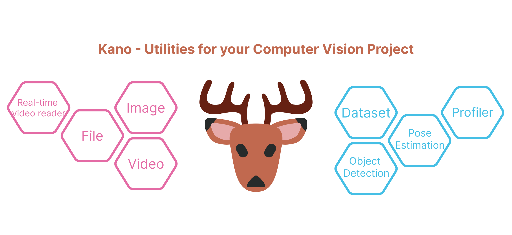

# Home

# 🦌 Kano - Utilities for your Computer Vision Projects



**Kano** is a Python package providing utility functions for Computer Vision tasks. Its primary focus is simplifying lengthy functions, allowing developers to concentrate more on the main processes.

## 📥 Installation

[The latest released version](https://pypi.org/project/kano-cv/) is available on PyPI. You can install it by running the following command in your terminal:

```bash
pip install kano-cv
```

## 🚀 Usage

Explore the [Kano Document]() to learn how to use supported functions and see examples. **Kano** currently provides utilities for these groups:

- [Common tasks]():
  - [Files/Folders Manipulating]()
  - [Images Processing]()
  - [Videos Processing]()
- [Computer vision tasks]():
    - [YOLO-formatted Dataset]()
    - [Object Detection]()
    - Pose Estimation (In progress)
    - Object Segmentation (In progress)
